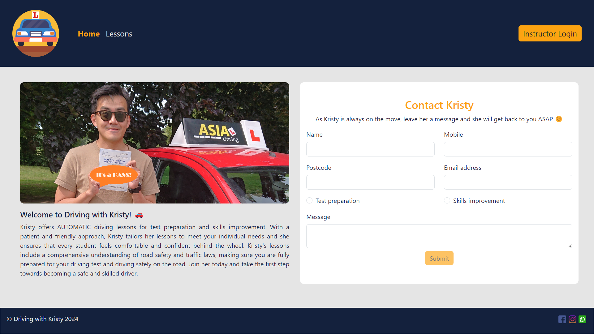
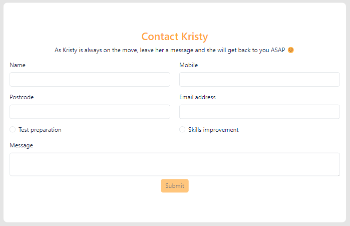
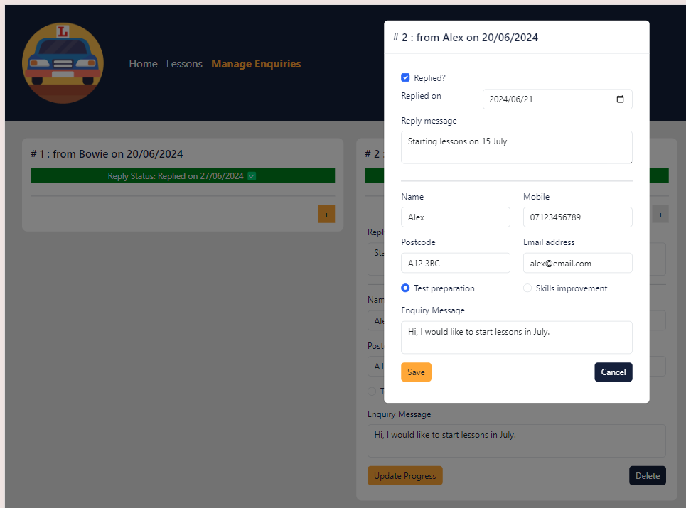

# Driving School Web Application

Welcome to this repo! This is about a driving school web application &#x1F697; which can be accessed by this [link](https://df-capstone-fe.onrender.com/).

_Screen capture of homepage_

## Introduction

This application is a promotion tool for a driving school - Driving with Kristy as well as a means for Kristy to manage the information of prospective customers conveniently. Customer enquiries will be centrally managed and recorded on the application.

Driving instructors are always on the move on the road during normal working hours. But enquiries about their service won't stop coming during the day. However, answering these enquiries is important because prospective customers may be gone if they don't hear back from an instructor for some time. The reality is that it is often hard to keep up with answering these enquiries which could come from different channels including by phone, messaging services, email, website, etc. Instructors spend quite a lot of efforts in replying to these enquiries even if they are only simple questions about driving tests content, pricing and what are included in the lessons. It is also difficult to keep track of the information provided by prospective customers. For example, if a prospective customer approaches an instructor over by SMS, they would mention information like their postcode, whether they are taking a driving test or want to improve their driving skills and their availability during the conversation. When organising their timetable, an instructor would have to scroll through the conversation on their phone to mark down the information somewhere. With this application, hopefully most prospective customers would register their interests using the website contact form which already includes appropriate input fields for them to fill in relevant categories of information. Any personal particulars stored in the application is also safe when only an authenticated user can access it.

In light of the business problems above, the application offers the following benefits:

1. Attracts prospective customers with clear information provided on a neat user interface

   Essential information such as lesson content, pricing and reference materials about driving tests will be provided in the website for all visitors. This would be very handy for prospective customers to know whether they would be interested in the instructor's service. A good website with a clean user interface also projects a professional image.

2. Provides better customer service by providing a handy contact form which could be easily filled in

   Instead of just providing a phone number and having prospective customers call or message instructors while instructors are notorious for not picking up their phones and not replying to messages instantly (legitimately because it is against the law to use digital devices when teaching a learner driver!), the contact form provides a convenient way for prospective customers to register their interests. The input fields indicate what an instructor would want to know to consider whether they could take someone on, so there would be no need to ask for further information back and forth.

3. Maintains tidy and secured record of prospective customers' personal particulars and enquiries

   Similar to the point above, necessary categories of information have been included in the contact form and the backend of the application. There would be no need for the instructor to try to find bits and pieces of information like they would have to do if an enquiry is received from a messaging service and email, or the piece of paper for marking down what has been said after a telephone conversation. Moreover, a user (i.e. the instructor) logs into the application using token-based authentication and their password is hashed, so the storage of prospective customers' personal data is secure.

4. Centrally manages progress of replying to enquiries and minimise missed replies

   As enquiries are dated and there is a reply status property for each enquiry, it would be easy for the instructor to know whether they have missed an enquiry. All enquiries can be viewed on the dashboard after the instructor logs in, and information about the replies can be stored as well.

## Set Up

The backend of the application is an Express RESTful API with a MongoDB database, and the frontend is built using Vite in ReactJS. Users interact with the backend through the frontend. There will be two types of users, namely admin and visitor. Admin access is served for the owner of the driving school. All other visitors would not be assigned any account or login function.

A visitor will be able to make POST requests by submitting the contact form, while the admin will be able to make GET, PATCH and DELETE requests in the enquiries page which will be accessible after logging in. Below are a list of the routes the application has:

1. Adding an enquiry by visitor - POST request to `/auth/login`
2. Reading all enquiries received by admin - GET request to `/enq` with authentication header
3. Updating an enquiry received by admin - PATCH request to `/enq/:id` with authentication header and id of the enquiry as payload
4. Deleting an enquiry received by admin - DELETE request to `/enq/:id` with authentication header and id of the enquiry as payload

## Features

All visitors will be able to see the information below on the website:

- brief introduction of school
- driving lesson information and pricing
- contact of driving school

Visitors will also be able to send their contact information to the school in a form. The information collected will include:

- preferred name
- mobile phone number
- email address
- postcode
- test preparation or skills improvement
- enquiry message
- enquiry date (automatically generated)

_Contact form screen capture_

### Web Application When Logged In

Kristy will be able to log into the web application as an admin. After logging in, she will be able to view, edit and delete contact information of prospective customers who have sent their information via the website form. The fields include all of the information in the form and three more pieces of data to record Kristy's reply to the prospective customers:

- preferred name
- mobile phone number
- email address
- postcode
- test preparation or skills improvement
- enquiry message
- enquiry date (automatically generated)
- reply status
- reply date
- reply message

_Edit form screen capture_

## Upcoming Features

The following features could be added to expand the functionality of the application in order of priority:

- use of an external API to show a map of the address of the prospective customer

- create, update and delete an existing customer's profile (information marked with an \* are new):

  - first name\*
  - middle name\*
  - preferred name
  - last name\*
  - mobile phone number
  - email address
  - first line of address\*
  - postcode
  - driving licence number\*
  - test preparation or skills improvement
  - test date\*
  - test centre\*
  - enquiry message
  - enquiry date
  - reply status
  - reply date
  - reply message
  - date added as student\*
  - learning progress\*

- use of Google calendar to schedule lessons with students

- introduction of student role and relevant functionalities - view lessons and teaching materials, request for lessons, etc.

- introduction of instructor users and relevant functionalities - matching students to the instructor, teaching schedule, active locations, etc.
