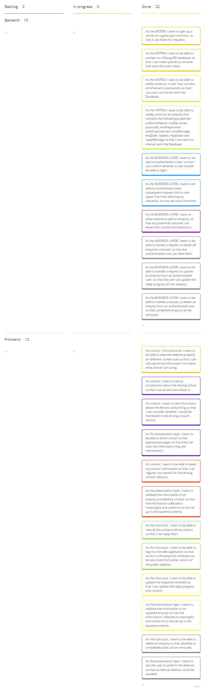
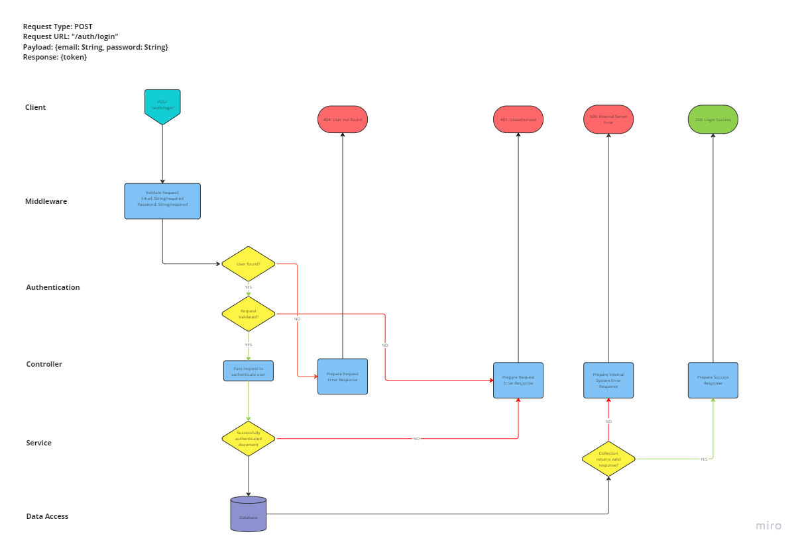
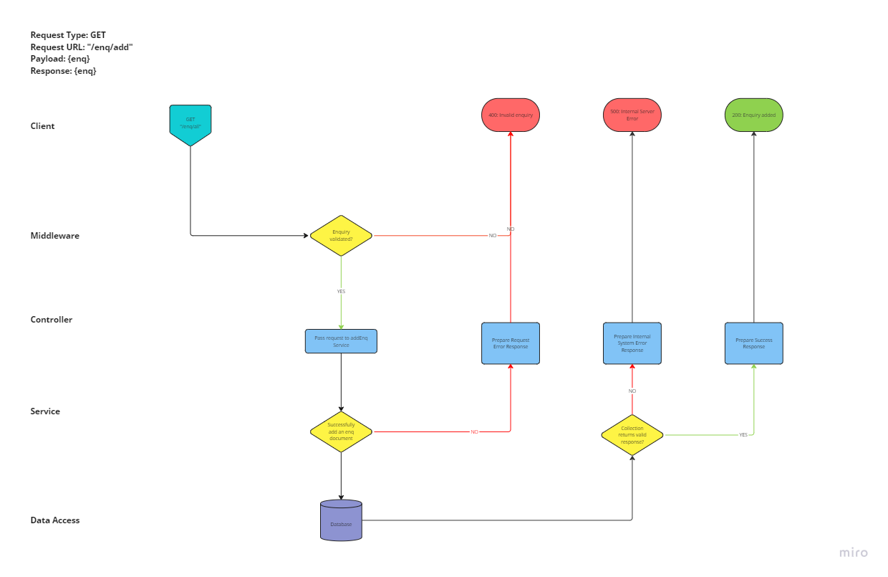
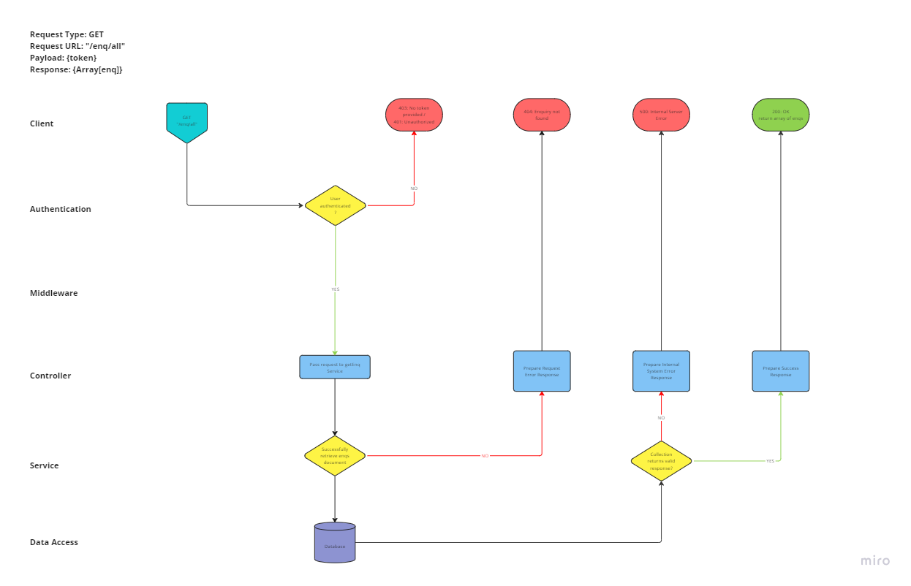
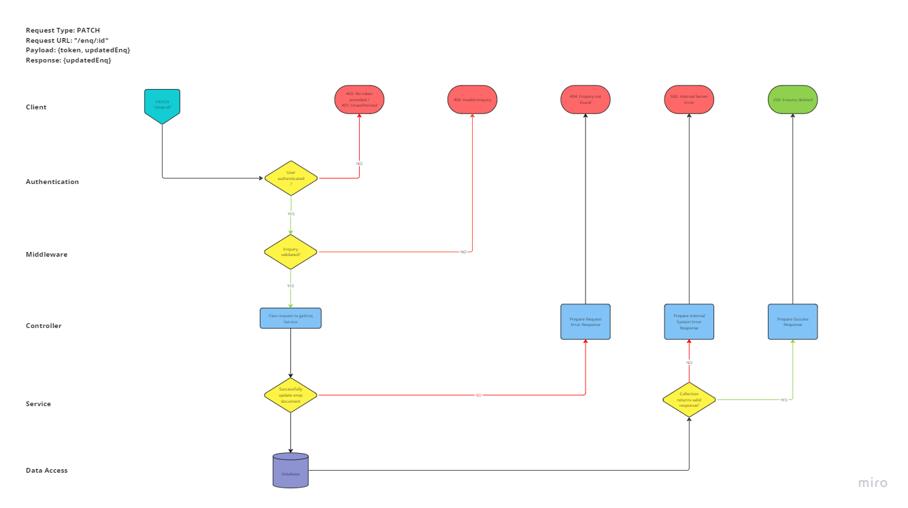
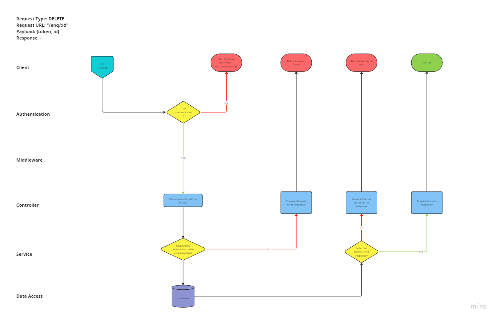
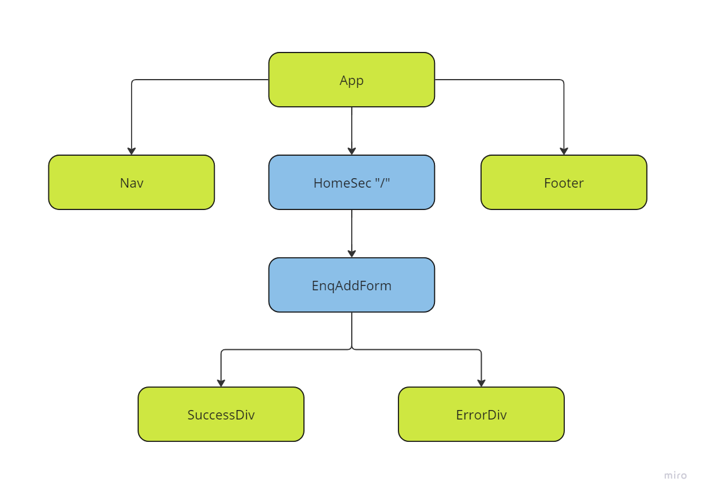
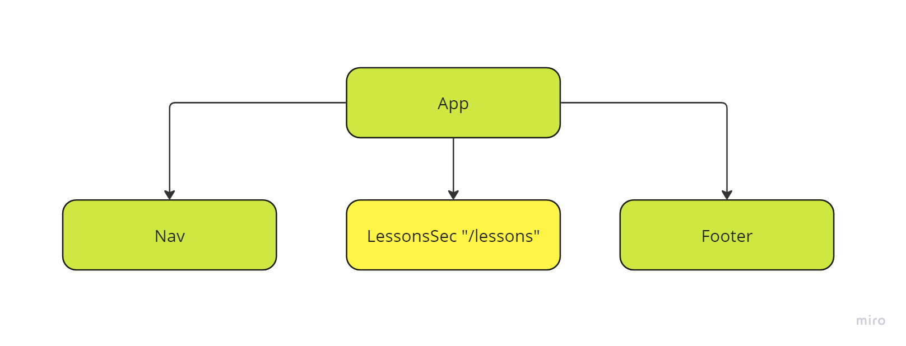
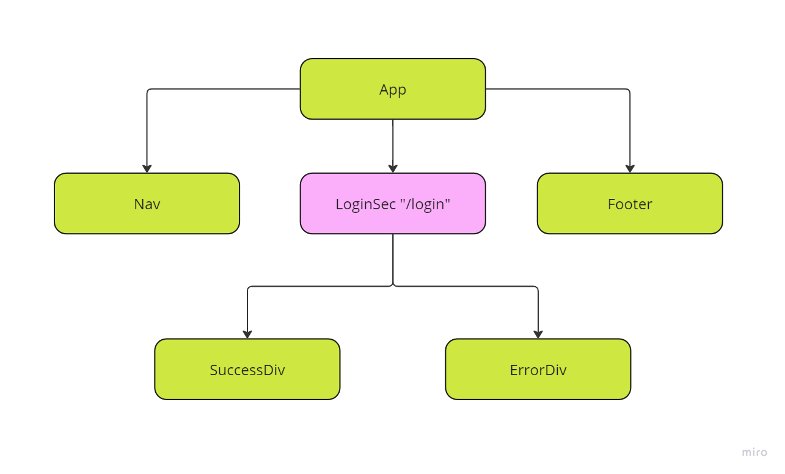
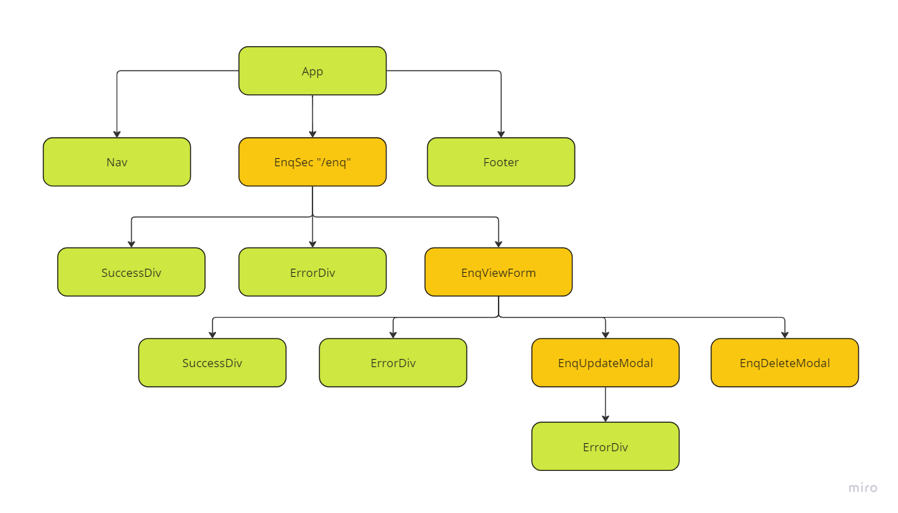

# Project Planning

## User Stories (in Kanban board)

(Previous progress updates of the board is shown in the other snapshots stored in the `documentation/img` folder)

## Routing Diagrams of Backend RESTful API

## Component Trees of Frontend React JS Vite Site

Home - "/"

Lessons - "/lessons"

Instructor Login - "/login"

Manage Enquiries - "/enq"

## Tests Conducted

### Backend:

**Authenticate service tests**

- authenticateUser tests
  - [x] should call authenticateUser on the User model
  - [x] should return the result of calling authenticateUser on the User model
  - [x] should throw an error when username is not found
  - [x] should throw an error when password is invalid

**Authenticate controller tests**

- sendAuthRes tests
  - [x] should send back a 200 status and user details when user is authenticated
  - [x] should send back a 404 status when username is not found
  - [x] should send back a 401 status when password is invalid
  - [x] should send back a 500 status when service returns an error

**Enquiries services tests**

- addEnq tests
  - [x] should add a valid enquiry
  - [x] should throw an error when save fails
- getEnqs tests
  - [x] should get all enquiries
  - [x] should throw an error when there is no enquiry
- updateEnq tests
  - [x] should update an enquiry
  - [x] should throw an error when invalid ID is provided
- deleteEnq tests
  - [x] should delete an enquiry
  - [x] should throw an error when invalid ID is provided

**Enquiries controller tests**

- sendAddEnqRes tests
  - [x] should return a 201 status and the enquiry when a valid enquiry is added
  - [x] should return a 400 status when an invalid enquiry is sent
  - [x] should return a 500 status when addEnquiry throws an error
- sendGetEnqsRes tests
  - [x] should return a 200 status and all enquiries
  - [x] should return a 404 status when there is no enquiry
  - [x] should return a 500 status when getEnqs throws an error
- sendUpdateEnqRes tests
  - [x] should send a 202 status when a valid ID and enquiry are provided
  - [x] should return a 404 status when an enquiry is not found
  - [x] should send a 500 status when updateEnq throws an error
- sendDeleteEnqRes tests
  - [x] should send a 200 status when a valid ID is provided
  - [x] should return a 404 status when an enquiry is not found
  - [x] should send a 500 status when updateEnq throws an error

**Integration tests**

- POST requests to '/auth/login' on authRoutes
  - [x] should send a 200 status when user is authenticated
  - [x] should send a 404 status when user is not found
  - [x] should send a 401 status when user is not found
  - [x] should send a 500 status when there is an error
- POST requests to '/enq/add' on enqRoutes
  - [x] should send a 201 status when a valid enquiry is sent
  - [x] should send a 400 status when an empty enquiry is sent
  - [x] should send a 400 status when preferred name is missing
  - [x] should send a 400 status when mobile is missing
  - [x] should send a 400 status when email is missing
  - [x] should send a 400 status when email is invalid
  - [x] should send a 400 status when postcode is missing
  - [x] should send a 400 status when postcode is invalid
  - [x] should send a 500 status when there is an error
- GET requests to '/enq/all' on enqRoutes
  - Tests after successful login
    - [x] should send a 200 status when enquiry is updated
    - [x] should send a 404 status when no enquiry is found
  - Tests without logging in
    - [x] should return a 403 status when no token is provided
    - [x] should return a 401 status when an invalid token is provided
- PATCH requests to '/enq/:id' on enqRoutes
  - Tests after successful login
    - [x] should send a 202 status when enquiry is updated
    - [x] should send a 404 status when enquiry ID is not found
    - [x] should send a 400 status when an invalid enquiry is provided
    - [x] should send a 500 status when there is an error
  - Tests without logging in
    - [x] should return a 403 status when no token is provided
    - [x] should return a 401 status when an invalid token is provided
- DELETE requests to '/enq/:id' on enqRoutes
  - Tests after successful login
    - [x] should send a 200 status when enquiry is deleted
    - [x] should send a 404 status when enquiry ID is not found
    - [x] should send a 500 status when there is an error
  - Tests without logging in
    - [x] should return a 403 status when no token is provided
    - [x] should return a 401 status when an invalid token is provided

### Frontend:

**Services tests**

- addEnqService tests

  - [x] should return 'Enquiry is added' when enquiry is added
  - [x] should return an error object with provided error message

- authService tests

  - [x] should store the token in cookies and return 'Login success'
  - [x] should return an error object with provided error

- getEnqsService tests

  - [x] should return all enquiries in an array
  - [x] should return an error object with provided error message

- updateEnqService tests

  - [x] should return a 202 status and updated enquiry when update is successful
  - [x] should return an error object with provided error message

- deleteEnqService tests
  - [x] should return 'Enquiry deleted' when the enquiry is successfully deleted
  - [x] should return an error object with provided error message

**Utils tests**

- Date Formatter tests

  - formatDate tests

    - [x] should format ISO date string into dd/mm/yyyy

  - shortenDate tests
    - [x] should format ISO date string into yyyy-mm-dd

- Validator tests

  - validatePassword tests

    - [x] should return true when the password has at least 8 characters long and contain at least one uppercase letter, one number, and one special character
    - [x] should return false when the password is empty
    - [x] should return false when the password has fewer than 8 characters
    - [x] should return false when the password has no uppercase letter
    - [x] should return false when the password has no number
    - [x] should return false when the password has no special character

  - validateMobile tests

    - [x] should return true when the mobile has 11 digits starting with '07'
    - [x] should return false when the mobile has more than 11 digits
    - [x] should return false when the mobile is empty
    - [x] should return false when the mobile has fewer than 11 digits
    - [x] should return false when the mobile does not start with '07'

  - validateEmail tests

    - [x] should return true when the email address is valid
    - [x] should return false when the email address is empty
    - [x] should return false when the email address is invalid

  - validatePostcode tests

    - [x] should return true when the postcode is valid (5 alphanumeric characters with a space between outward and inward codes)
    - [x] should return true when the postcode is valid (5 alphanumeric characters without a space between outward and inward codes)
    - [x] should return true when the postcode is valid (6 alphanumeric characters with a space between outward and inward codes)
    - [x] should return true when the postcode is valid (6 alphanumeric characters without a space between outward and inward codes)
    - [x] should return true when the postcode is valid (7 alphanumeric characters with a space between outward and inward codes)
    - [x] should return true when the postcode is valid (7 alphanumeric characters without a space between outward and inward codes)
    - [x] should return false when the postcode has no alphabets in outward code
    - [x] should return false when the postcode has no alphabets in inward code
    - [x] should return false when the postcode has no numeric digit in outward code
    - [x] should return false when the postcode has no numeric digit in inward code

  - validateTestAndSkills tests

    - [x] should return true when testPreparation and skillsImprovement are not the same
    - [x] should return true when testPreparation and skillsImprovement are both true
    - [x] should return true when testPreparation and skillsImprovement are both undefined
    - [x] should return true when testPreparation and skillsImprovement are both false

  - validateReplyDate tests

    - Tests when a reply date is required

      - [x] should return true when reply date is later than enquiry date
      - [x] should return true when reply date is the same as enquiry date
      - [x] should return true when reply date is later than enquiry date only in time
      - [x] should return false when reply date is earlier than enquiry date
      - [x] should return false when reply date is earlier than enquiry date

    - Tests when a reply date is not required
      - [x] should return true when reply date is falsy
      - [x] should return false when reply date is truthy

  - validateReplyStatus tests
    - [x] should return true when both the reply date and reply status are truthy
    - [x] should return true when both the reply date and reply status are falsy
    - [x] should return false when the reply date is truthy and reply status is falsy
    - [x] should return false when the reply date is falsy and reply status is truthy

**Components tests**

- App tests

  - [x] should render Nav, HomeSec and Footer when App starts
  - [x] should render LessonsSec at '/lessons'
  - [x] should render LoginSec at '/login'
  - [x] should render PageNotFound at an unknown path

- EnqAddForm tests

  - [x] renders normally (i.e. without ErrorDiv) when add form has not been touched
  - [x] renders ErrorDiv when name is empty after the add form has been touched
  - [x] renders ErrorDiv when mobile is empty after the add form has been touched
  - [x] renders normally when mobile is valid
  - [x] renders ErrorDiv when mobile is invalid
  - [x] renders ErrorDiv when postcode is empty after the add form has been touched
  - [x] renders normally when postcode is valid
  - [x] renders ErrorDiv when postcode is invalid
  - [x] renders ErrorDiv when email address is empty after the add form has been touched
  - [x] renders normally when email address is valid
  - [x] renders ErrorDiv when email address is invalid
  - [x] renders ErrorDiv when both the test preparation and skills improvement radio button are unchecked after the add form has been touched
  - [x] renders normally when either one of the test preparation and skills improvement radio buttons is checked
  - [x] submit button is disabled when add form is invalid
  - [x] renders SuccessDiv and the submit button disabled when the enquiry is successfully added
  - [x] renders error message and the submit button disabled when the enquiry cannot be added

- EnqDeleteModal tests

  - [x] renders the modal with the correct index

- EnqSec tests

  - [x] renders testEnq when enquiries are available
  - [x] renders fail message when enquiries are not available

- EnqUpdateForm tests

  - [x] renders normally (i.e. without ErrorDiv) when edit form has not been touched
  - [x] renders ErrorDiv when reply status is invalid
  - [x] renders normally when reply status is valid
  - [x] renders ErrorDiv when reply date is invalid
  - [x] renders normally when reply date is valid
  - [x] renders ErrorDiv when name is removed
  - [x] renders ErrorDiv when mobile is empty
  - [x] renders normally when mobile is valid
  - [x] renders ErrorDiv when mobile is invalid
  - [x] renders ErrorDiv when postcode is empty
  - [x] renders normally when postcode is valid
  - [x] renders ErrorDiv when postcode is invalid
  - [x] renders ErrorDiv when email address is empty
  - [x] renders normally when email address is valid
  - [x] renders ErrorDiv when email address is invalid
  - [x] renders normally when either one of the test preparation and skills improvement radio buttons is checked
  - [x] save button is disabled when update form is invalid
  - [x] success message is available after successful update
  - [x] error message is available after unsuccessful update

- EnqViewForm tests

  - [x] renders normally when an enquiry is available
  - [x] renders replied status header when the enquiry has already been replied
  - [x] renders not yet replied status header when the enquiry has not been replied
  - [x] opens update modal when update progress button is clicked
  - [x] opens delete modal when delete button is clicked

- ErrorDiv tests

  - [x] renders test message in component

- LoginSec tests

  - [x] renders normally (i.e. without ErrorDiv) when username is empty before the login form has been touched
  - [x] renders normally when password is empty before the login form has been touched
  - [x] renders ErrorDiv when username is empty after the login form has been touched
  - [x] renders normally when password is valid
  - [x] renders ErrorDiv when password is empty after the login form has been touched
  - [x] renders ErrorDiv when password is invalid
  - [x] login button is disabled when login form is invalid
  - [x] renders SuccessDiv and logout button when user successfully logs in
  - [x] renders ErrorDiv and login button when user fails to log in

- Nav tests

  - [x] renders 'Home', 'Lessons' and 'Instructor Login' when user is not logged in
  - [x] renders 'Home', 'Lessons', 'Manage Enquiries' and 'Logout' when user is logged in
  - [x] renders 'Home', 'Lessons' and 'Instructor Login' when user is not logged in

- SuccessDiv tests

  - [x] renders test message in component
